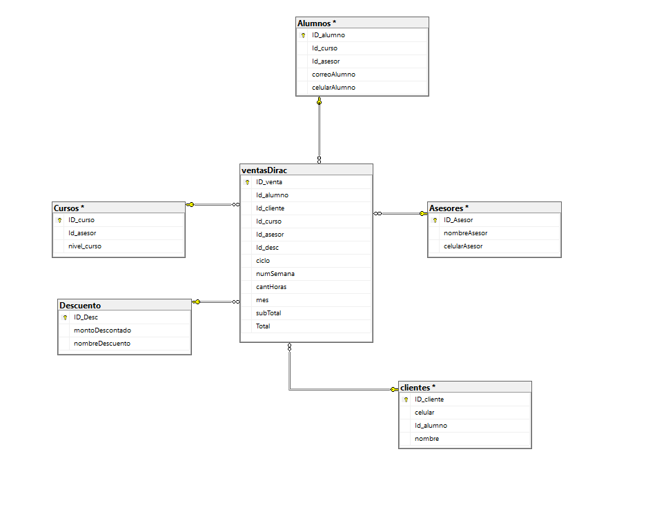

# Documentacion-de-Inks-Software
Aquí podrás encontrar referencias de los softwares implementados para cada Cliente/Empresa con la que se ha trabajado

## Clientes

### DIRAC
- **Descripción:** Implementación de una base de datos en SQL Server.
- **Objetivo:** Facilitar el análisis de información de los clientesy optimizar la gestión de datos obtenidos
- **Tecnologías usadas:** SQL Server.
- **Capacitaciones brindadas:** uso sobre consultas avanzadas, automatizaciones y uso de Copias de Seguridad y BackUps

## Imágenes

### Esquema de la base de datos DIRAC

### Otra vista de la base de datos

